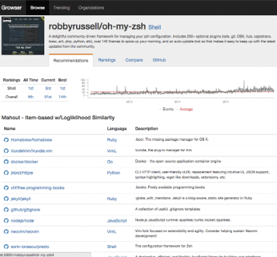

# Growser

A recommendation engine and project explorer for GitHub.com.

1. [Apache Mahout 0.9](http://mahout.apache.org/) (pre-Spark)
1. [Apache Spark 1.5.1](http://spark.apache.org/)
1. [PredictionIO 0.9.5](https://prediction.io/)
1. [GraphLab Create 1.6.1](https://dato.com/products/create/)

## Requirements

1. Python 3.4+
1. Google Cloud

## Setup

### Google Cloud

A Google Cloud account with Cloud Storage & BigQuery enabled is required to extract data from the [GitHub Archive public dataset](https://www.githubarchive.org/).
